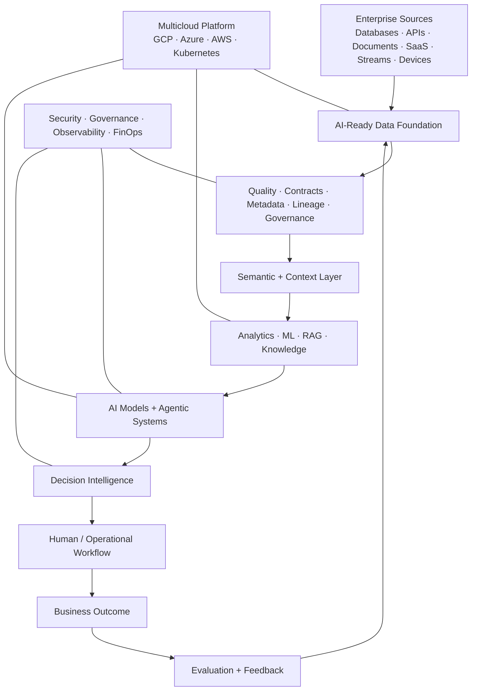

<div align="center">

# Carlos Saritama

## Data & AI Technology Leader | Enterprise AI Systems Architect | AI-Ready Platforms | Agentic AI | Multicloud

**Strategy · Product · Data · AI · Architecture · Engineering · Governance · Cloud**

**I design, build and lead enterprise Data & AI systems—from AI-ready data foundations and context layers to agentic applications, decision intelligence and multicloud production platforms.**

</div>

---

> **Systems over demos. Evidence over hype. Context before autonomy. Decisions over dashboards.**


## At a glance

| | |
| --- | --- |
| **Vision** | Turn ambiguous business problems into Data & AI platform strategies and measurable decision systems. |
| **Architecture** | AI-ready data, context layers, ML/LLM systems, agents, governance and multicloud platforms. |
| **Execution** | Specification-driven development, implementation, integration, deployment, observability and continuous improvement. |
| **Leadership** | Connect executives, product, domain experts, data and engineering around one system and one outcome. |

**Core operating range:** strategy → product → architecture → engineering → deployment → governance → business outcome.

---


## Executive vision + technical depth

I am a **systems engineer by foundation** operating across the full Data & AI lifecycle: from ambiguous business problem and technology strategy to architecture, implementation, deployment, governance and measurable outcomes.

I combine **leadership-level systems thinking with implementation-level technical depth**.

I stay hands-on where technical understanding changes the quality of a decision:

**data architecture · APIs · distributed systems · retrieval · ML / LLM behavior · agents · context engineering · evaluation · security · observability · cloud platforms · failure analysis**

while operating at the broader system level:

**strategy · product direction · architecture governance · platform roadmaps · build-vs-buy decisions · operating models · risk · adoption · cost · business value**

```text
Business problem
       ↓
Decision / product objective
       ↓
AI-ready data foundation
       ↓
Enterprise context + semantics
       ↓
Analytics / ML / deterministic systems
       ↓
AI + agentic workflows
       ↓
Human / autonomous action
       ↓
Multicloud platform + governance
       ↓
Business outcome
       ↓
Evaluation + feedback
```

---

# Architecture thesis

## AI-Ready → Agent-Ready → Decision-Ready

### AI-Ready Data

Enterprise AI begins before the model.

Data must become:

`trusted · accessible · quality-controlled · governed · secure · documented · observable · fresh · lineage-aware · semantically meaningful`

I think about data as **reusable AI-ready products**, not merely tables or pipelines.

A mature data product should increasingly expose:

`Owner · Schema · Contract · Quality · Freshness · Metadata · Lineage · Permissions · Business meaning · Intended use · AI fitness`

### Agent-Ready Context

Agents need more than raw data. They need:

`Business semantics · Knowledge · Entity relationships · Policies · Permissions · Tools / APIs · Historical context · Real-time context`

This is where **context engineering** becomes an architecture discipline: selecting, structuring, governing and evaluating what an intelligent system is allowed to know and do.

Prompting is only one part of that system.

### Decision-Ready Intelligence

The goal is not another chatbot.

The goal is systems that produce or support actions with:

`Evidence · Provenance · Uncertainty · Evaluation · Permissions · Accountability · Observability · Outcome tracking`

```text
Evidence
   ↓
Deterministic analytics / ML
   ↓
AI reasoning / agents
   ↓
Recommendation or action
   ↓
Human oversight when required
   ↓
Outcome
   ↓
Feedback
```

---

# Enterprise Data & AI architecture



I treat **Data & AI as decision infrastructure**. Models are only one component of that system.

---

# From strategy to production

### Strategy & product

Business problem framing · Data & AI strategy · use-case architecture · product direction · platform strategy · build-vs-buy · technology selection · adoption · value realization

### Data & context

Data products · data architecture · pipelines · contracts · quality · metadata · lineage · semantic layers · knowledge architecture · structured / unstructured integration · AI-ready data

### AI & decision systems

Predictive ML · RAG · retrieval evaluation · grounded generation · agentic workflows · tools · MCP-style integration patterns · model routing · human-in-the-loop · Decision Intelligence

### Engineering & platforms

Python · SQL · APIs · FastAPI · distributed-system patterns · containers · Kubernetes · CI/CD · reliability · observability · production architecture

### Governance & leadership

Architecture governance · responsible AI · security · runtime policies · model / vendor selection · evaluation gates · engineering standards · platform roadmaps · cross-functional technical leadership

---

# Forward-deployed execution

I am especially effective where strategy, architecture and delivery remain connected to the real user.

```text
Discovery
   ↓
Technical scoping
   ↓
Specification
   ↓
System design
   ↓
Build / integrate
   ↓
Deploy
   ↓
Measure adoption + workflow impact
   ↓
Feed learning back into product and architecture
```

That means moving comfortably between executives, domain experts, product teams and engineers—and contributing directly to implementation when progress depends on technical depth.

---

# Specification-driven + agentic engineering

As coding agents become more capable, the bottleneck moves from writing every line manually to **defining intent, context, constraints, verification and control**.

```text
Problem
  ↓
Specification
  ↓
Acceptance criteria
  ↓
Architecture decisions
  ↓
Human + coding-agent implementation
  ↓
Tests + evals + guardrails
  ↓
Deployment evidence
  ↓
Observability + feedback
```

Practices I value:

- specification-driven development;
- `AGENTS.md`, architecture decisions and scoped repository context;
- context engineering rather than prompt-only engineering;
- automated tests and eval-driven development;
- governed tools, permissions and human approvals;
- tracing and observability for agent behavior;
- reusable skills, playbooks and building blocks;
- explicit separation between implemented, validated and proposed capability.

---

# Operating disciplines

| Discipline | What it protects or optimizes |
| --- | --- |
| **DevOps / Platform Engineering** | delivery speed, repeatability, runtime reliability |
| **DataOps** | contracts, quality, lineage, freshness, trustworthy data products |
| **MLOps** | model lifecycle, reproducibility, monitoring and retraining |
| **LLMOps / AgentOps** | context, tools, evals, tracing, guardrails and runtime behavior |
| **SRE / Observability** | reliability, incidents, metrics, logs, traces and learning loops |
| **FinOps** | cloud cost, tokens, compute and architecture economics |
| **SecOps / AI Governance** | identity, permissions, secrets, policy, auditability and risk |

The objective is **controlled speed**, not process for its own sake.

---

# Technology-agnostic systems engineering

I do not build my professional identity around one framework.

I work from architectural primitives:

`data · compute · storage · network · identity · events · APIs · context · models · tools · policies · observability · economics`

That makes it possible to evaluate and integrate emerging technologies without forcing them into problems where they do not belong.

Depending on the business case, that can include:

- event-driven and streaming systems;
- IoT / edge data and device workflows;
- digital-twin patterns;
- distributed-ledger / blockchain architectures when trust and shared state justify them;
- real-time decision systems;
- autonomous and semi-autonomous agents;
- new model, tool and protocol ecosystems.

**The technology can change. The systems-engineering questions remain.**

---

# Current technology frontier

I actively follow and build toward:

**AI-ready data · semantic / context layers · context engineering · agentic AI · long-running agents · tool ecosystems · MCP-style interoperability · AI gateways · model routing · agent evaluation · guardrails · human approvals · agent observability · LLMOps / MLOps · DataOps · platform engineering · multicloud AI · FinOps**

The goal is not to chase every framework.

It is to understand **which architectural capabilities survive framework changes**.

---

# Flagship systems

## ⚾ [PennantIQ — Baseball Decision Intelligence](https://github.com/cssaritama/pennantiq-baseball-decision-intelligence)

Evidence-first Decision Intelligence for pre-game strategy and organizational learning.

**Demonstrates:** Agentic AI · RAG · deterministic analytics · evaluation · human-in-the-loop · GCP-oriented architecture

## 🏆 [StandingsOS — Competition Intelligence](https://github.com/cssaritama/StandingsOS)

AI-ready competition intelligence built around a strict source-of-truth model.

**Demonstrates:** Product engineering · AI-ready data contracts · semantic definitions · readiness gating · forecasting · grounded AI · Azure-first architecture · Kubernetes · multicloud portability

## 🏭 [Predictive Maintenance MLOps](https://github.com/cssaritama/Predictive-Maintenance-Mlops)

End-to-end predictive-maintenance system covering model lifecycle and operations.

**Demonstrates:** Predictive ML · MLflow · Prefect · FastAPI · MLOps · monitoring · reproducibility

## 🌐 [KAIROSKOP — Collective Attention Observatory](https://github.com/cssaritama/KAIROSKOP-A-Collective-Attention-Observatory)

Data & AI exploration of changing information signals and collective attention.

**Demonstrates:** Data products · AI-assisted analysis · signal intelligence · exploratory systems thinking

### Additional systems

- 📈 **[Algorithmic Trading Strategy Development](https://github.com/cssaritama/Algorithmic-Trading-Strategy-Development-Project)** — quantitative research and reproducible decision systems.
- 🧠 **[RAG Mental Health Assistant](https://github.com/cssaritama/RAG-Mental-Health-Assistant-Project)** — retrieval-augmented application patterns, grounding and evaluation.

---

# Multicloud strategy

Multicloud is not a collection of provider badges.

I separate **portable business capability** from **provider-native platform capability**.

### Google Cloud
`BigQuery · Vertex AI · GKE / Cloud Run · Cloud Storage · IAM`

### Microsoft Azure
`AKS · ACR · Azure PostgreSQL · Key Vault · Azure Monitor · Microsoft Foundry`

### AWS
`EKS / ECS · RDS · S3 · Bedrock / SageMaker · CloudWatch`

The objective is to know **what should remain portable and where cloud-native services create strategic leverage**.

---

# How I think about AI

**Data establishes evidence.**  
**Semantics establish meaning.**  
**Deterministic systems establish facts.**  
**ML estimates patterns and uncertainty.**  
**AI adds reasoning and interaction.**  
**Agents coordinate context, tools and workflows.**  
**Governance defines permissions and boundaries.**  
**Humans retain accountability where consequences matter.**  
**Outcomes determine whether the system created value.**

---

# Engineering & leadership principles

1. Start with the **business decision**, not the model.
2. Make enterprise data **AI-ready before asking AI to reason over it**.
3. Give agents **context and governed tools**, not unrestricted access.
4. Use specifications to make intent and acceptance criteria explicit.
5. Keep deterministic calculations outside LLMs when code can own them.
6. Make evidence, uncertainty, provenance and lineage inspectable.
7. Treat evaluation, observability and abstention as product capabilities.
8. Separate implemented capability from roadmap and reference architecture.
9. Design security and governance into the architecture.
10. Treat architecture as an **economic decision**, including FinOps and operational cost.
11. Measure business outcomes, not merely technical outputs.
12. Keep systems extensible as models, clouds and frameworks evolve.

---

<div align="center">

### Building the enterprise foundation that makes trustworthy AI possible.

**Make the data ready. Make the context explicit. Govern the intelligence. Ship the system. Improve the decision.**

</div>
